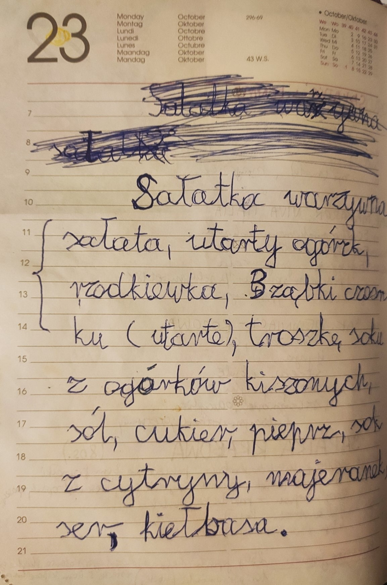

  

  
  Feel free to connect with me!
  
  

<h1>About me</h1>

A chatterbox since a kid, I find it easy to connect with others, which helps with collaboration at work. I consider myself highly organized, however also quite spontaneous and flexible. I am a fast-learner, although I know when to reach out for help. Thanks to those traits I found success in project management as part of Students' Union of Wroclaw University of Science and Technology (WUST).

Here are some of the events I organized / co-organized:
* Student fan zone during the FIFA World Cup in 2018 ⚽
* Explosion of Colors as part of the Juwenalia of WUST 💥
* Polliwood Welcome Party of WUST 🎉
* 2x Official Christmas "Movie" of WUST 🎥

Having finished studies, I am eager to kick-start my career in mobile development. Despite my preference for working remotely, I still genuinely appreciate spending time with my coworkers (_partly influenced by my love for the show The Office_ 👔).

<h1>Skills</h1>

💡 _- currently learning_

<table>
  <tr>
    <td>🔹 Flutter</td>
    <td>🔸 Other</td>
  </tr>
  <tr valign="top">
    <td>
      <ul>
        <li><strong>Flutter SDK</strong></li>
        <li><strong>Dart SDK</strong></li>
        <li><strong>DevTools</strong></li>
        <li><strong>State management</strong>
          <ul>
            <li>BloC/Cubit (+hydrated_bloc)</li>
            <li>MobX</li>
            <li>Riverpod (+riverpod_generator)</li>
            <li>Provider</li>
          </ul>
        </li>
        <li><strong>Dependency Injection</strong>
          <ul>
            <li>GetIt</li>
          </ul>
        </li>
        <li><strong>Navigation</strong>
          <ul>
            <li>GoRouter</li>
            <li>AutoRoute 💡</li>
          </ul>
        </li>
        <li><strong>HTTP Networking</strong>
          <ul>
            <li>http</li>
            <li>dio</li>
            <li>Retrofit</li>
            <li>Chopper</li>
          </ul>
        </li>
        <li><strong>Hooks</strong></li>
        <li><strong>RxDart 💡</strong></li>
        <li><strong>Equatable</strong></li>
        <li><strong>Freezed (+json_serializable)</strong></li>
      </ul>
    </td>
    <td>
      <ul>
        <li><strong>Firebase</strong>
          <ul>
            <li>Cloud Firestore</li>
            <li>Realtime Database</li>
            <li>Authentication</li>
            <li>Storage</li>
            <li>Cloud Messaging (Push Notifications)</li>
            <li>Crashlytics</li>
            <li>Performance Monitoring</li>
            <li>Test Lab</li>
          </ul>
        </li>
        <li><strong>Git</strong>
          <ul>
            <li>Feature Branch Workflow</li>
            <li>Gitflow Workflow</li>
            <li>Forking Workflow</li>
            <li>Trunk-based Workflow</li>
          </ul>
        </li>
        <li><strong>Hive</strong></li>
        <li><strong>Isar DB</strong></li>
        <li><strong>SQL</strong></li>
        <li><strong>REST</strong></li>
        <li><strong>GraphQL</strong> 💡</li>
        <li><strong>Codemagic CI/CD</strong> 💡</li>
        <li><strong>Azure DevOps</strong></li>
        <li><strong>Design and prototyping</strong>: Figma, Adobe Xd</li>
        <li><strong>Agile project management</strong>: Scrum, Kanban</li>
        <li><strong>Native development</strong>
          <ul>
            <li><strong>Android</strong>: XML, Jetpack Compose (basics)</li>
            <li><strong>iOS</strong>: SwiftUI (basics)</li>
          </ul>
        </li>
      </ul>
    </td>
  </tr>
</table>

<h4>💬 Soft skills</h3>

* __Languages__: Polish (Native), English (Fluent)
* __Experience in conflict resolution__
* __Ability to lead and to be led__
* __Teamwork-orientation__
* __Desire for self-improvement__

<h1>Projects</h1>

<h3>🔵 Flutter</h3>

* <a href="https://github.com/macSro/eat_well">EatWell</a> - My BEng Thesis titled _"Mobile app for cooking enthusiasts featuring searching for recipes considering owned products"_. Implemented with Flutter, BloC and Firebase (Authentication, Cloud Firestore, Storage).

* <a href="https://github.com/macSro/eat_well_reviewer">EatWell Reviewer</a> - Complementary to EatWell. An app to be used by the reviewer in order to process reported missing ingredients. Implemented with Flutter, BloC and Firebase (Authentication, Cloud Firestore, Storage).

* <a href="https://github.com/macSro/City-Guide-New-York">City Guide</a> - A demo city guide app for New York. Implemented with Flutter, MobX, and Google Maps Platform.

* <a href="https://github.com/macSro/Google-ML-Kit-Playground">Google ML Kit Playground</a> - A simple app exploring the functionality of image labelers, text recognizers and object detectors. Implemented with Flutter and Google ML Kit.

* <a href="https://github.com/macSro/WorkSpacer">WorkSpacer</a> - A multilingual desk reservation app for companies. Created as a group project. Implemented with Flutter, MobX, Firebase (Authentication and Cloud Functions) and Strapi. 

* <a href="https://github.com/macSro/TODOs">TODOs</a> - A simple To-Do list app. Includes shared preferences integration. Implemented with Flutter and BloC.

* <a href="https://github.com/macSro/BMI-Calculator">BMI Calculator</a> - A BMI calculator app. Includes shared preferences integration. Implemented with Flutter and BloC.

* <a href="https://github.com/macSro/MastersThesis">Master's Thesis</a> - My MEng Thesis titled _"Comparative analysis of selected cross-platform frameworks in relation to native development approaches"_. Includes four different use-case scenarios, each represented by a mobile app developed with Kotlin (Jetpack Compose), Swift (SwiftUI), Flutter and React Native.

<h3>🟢 Native Android</h3>

* <a href="https://github.com/macSro/FootballMania">FootballMania</a> - A mobile app for football fans with features such as score monitoring, article browsing, following favorite teams, etc. Created as a group project. Implemented with Java, PostgreSQL, and Apache Tomcat.

<h3>🟠 Java</h3>

* <a href="https://github.com/macSro/Connect4-vs-AI">Connect4 vs AI</a> - Both a desktop game and a benchmarking tool which uses Minmax algorithm with alpha-beta pruning. Implemented with Swing (Java). 

* <a href="https://github.com/macSro/Sudoku-Solver">Sudoku Solver</a> - Desktop app that models Sudoku as Constraint Satisfaction Problem and solving it with Backtracking and Forward chaining. Implemented with JavaFX.

* <a href="https://github.com/macSro/TSP-Heurestic-Solver">Traveling Salesman Problem Solver</a> - Desktop app that solves Traveling Salesman Problem via a heuristic approach using Genetic Algorithm, and visualizes the algorithm performance for further research. Implemented with JavaFX.

<h1>Hobbies</h1>

Being a very social person, I prefer to spend most of my free time with friends and family. Thus, most of my hobbies reflect that. And when I need space, I put on my headphones to listen to music as a way to meditate. Below, you can find my TOP 3 favorite leisure activities.

<h2>Cooking</h2>

I've been showing signs of passion for cooking since I was a little kid. Not only would I happily help my parents in the kitchen _(not without sneaking a taste...)_, but I would also try to create new dishes myself! Here's a picture of my first recipe 🥗

  

<h4>Vegetable salad</h4>

Lettuce, grated cucumber, radish, 3 cloves of garlic (grated), a little pickle juice, salt, sugar, pepper, lemon juice, marjoram, cheese, sausage.

_Cheese and sausage, really???_ 🤨

<h2>Gaming</h2>

While I've definitely spent way too much time gaming online (mostly FPS, e.g. CS:GO and Valorant), I honestly prefer meeting with friends to play some board games. I'd say my favorite genre is strategy, which probably roots back to my childhood favorite video game: _Heroes of Might and Magic V_.

If you enjoy board and card games, I highly recommend you check out:
* <a href="https://boardgamegeek.com/boardgame/27627/talisman-revised-4th-edition">Talisman: The Magical Quest Game (Revised 4th Edition)</a> + Expansions
* <a href="https://boardgamegeek.com/boardgame/103343/game-thrones-board-game-second-edition">A Game of Thrones: The Board Game (Second Edition)</a>
* <a href="https://boardgamegeek.com/boardgame/21241/neuroshima-hex-30">Neuroshima Hex! 3.0</a>
* <a href="https://boardgamegeek.com/boardgame/9209/ticket-ride">Ticket to Ride</a> (whole series)
* <a href="https://boardgamegeek.com/boardgame/178900/codenames">Codenames</a> (whole series)
* <a href="https://boardgamegeek.com/boardgame/128882/resistance-avalon">The Resistance: Avalon</a>

&nbsp;

  

<h2>Traveling</h2>

Ever since I was a kid, I had this amazing opportunity to travel across the world. Of course, back then I only wanted to relax in the sun rather than wake up early to sightsee (my parents definitely did not agree nor let me 🫣). Looking back, I appreciate that deeply because now when I'm able to travel on my own, I value getting to know new cultures much more.

Below are the list of countries that I'd love to travel to and the list of countries that I've already "checked off".

<h3>My bucket list</h3>

<h4>South Korea</h4>

<h4>Japan</h4>

<h4>United States (West)</h4>

<h4>Iceland</h4>

<h4>Australia (Arachnophobia standing in the way)</h4>

<h3>Checked off ✅</h3>

* [ ] North America
  * [x] United States (East)
* [ ] Europe
  * [x] Austria
  * [x] Belgium
  * [x] Croatia
  * [x] Cyprus
  * [x] Czech Republic
  * [x] Denmark
  * [x] France
  * [x] Germany
  * [x] Greece
  * [x] Hungary
  * [x] Ireland
  * [x] Italy
  * [x] Malta
  * [x] Poland
  * [x] Spain
  * [x] Sweden
  * [x] Switzerland
  * [x] Ukraine
  * [x] United Kingdom

  

<h1>Thanks for stopping by! 🫡</h1>

  

<!-- To reset counter you should log in to the Ÿ HŸPE service, and then you will be able to reset counter on the https://yhype.me/ghpvc page. -->
