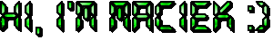

  

  Feel free to connect with me!
  
  

<h1>About me</h1>

A chatterbox since a kid, I find it easy to connect with others, which helps with collaboration at work. I consider myself highly organized, however also quite spontaneous and flexible. I am a fast-learner, although I know when to reach out for help. Thanks to those traits I found success in project management as part of Students' Union of Wroclaw University of Science and Technology (WUST).

Here are some of the events I organized / co-organized:
* Student fan zone during the FIFA World Cup in 2018 ⚽
* Explosion of Colors as part of the Juwenalia of WUST 💥
* Polliwood Welcome Party of WUST 🎉
* 2x Official Christmas "Movie" of WUST 🎥

Having finished studies, I am eager to kick-start my career in mobile development. Even though I enjoy a remote work style, I still highly appreciate spending time with coworkers (_additionally influenced by my adoration for the show The Office_ 👔).

<h1>Skills</h1>

<h3>🔹Flutter</h3>

* __Flutter SDK__
* __Dart SDK__
* __State management__
  * BloC/Cubit (+hydrated_bloc)
  * MobX
  * Provider
  * Riverpod \*
* __DevTools__

<h3>🔸 Other</h3>

* __Firebase__
  * Cloud Firestore
  * Realtime Database
  * Authentication
  * Storage
* __Hive__ \*
* __Git (+flows)__
* __SQL__
* __REST__
* __GraphQL__ \*
* __CI/CD__ \*
* __Design nad prototyping__: Figma, Adobe Xd
* __Agile project management__: Scrum, Kanban
* __Native development__
  * __Android__: XML, Jetpack Compose (basics)
  * __iOS__: SwiftUI (basics)

_\* - currently learning_

<h3>💬 Soft skills</h3>

* Languages: Polish (Native), English (Fluent)
* Teamwork-orientation
* Desire for self-improvement
* Experience in conflict resolution
* Ability to lead and to be led

&nbsp;

<h1>Projects</h1>

TODO...

<h1>Hobbies</h1>

Being a very social person, I prefer to spend most of my free time with friends and family. Thus, most of my hobbies reflect that. And when I need space, I put on my headphones to listen to music as a way to meditate. Below, you can find my TOP 3 favorite leisure activities.

<h2>Cooking</h2>

I've been showing signs of passion for cooking since I was a little kid. Not only would I happily help my parents in the kitchen _(not without sneaking a taste...)_, but I would also try to create new dishes myself! Here's a picture of my first recipe 🥗

  

<h4>Vegetable salad</h4>

Lettuce, grated cucumber, radish, 3 cloves of garlic (grated), a little pickle juice, salt, sugar, pepper, lemon juice, marjoram, cheese, sausage.

_Cheese and sausage, really???_ 🤨

<h2>Gaming</h2>

While I've definitely spent way too much time gaming online (mostly FPS, e.g. CS:GO and Valorant), I honestly prefer meeting with friends to play some board games. I'd say my favorite genre is strategy, which probably roots back to my childhood favorite video game: _Heroes of Might and Magic V_.

If you enjoy board games, I highly recommend you check out:
* <a href="https://boardgamegeek.com/boardgame/27627/talisman-revised-4th-edition">Talisman: The Magical Quest Game (Revised 4th Edition)</a> + Expansions
* <a href="https://boardgamegeek.com/boardgame/103343/game-thrones-board-game-second-edition">A Game of Thrones: The Board Game (Second Edition)</a>
* <a href="https://boardgamegeek.com/boardgame/21241/neuroshima-hex-30">Neuroshima Hex! 3.0</a>
* <a href="https://boardgamegeek.com/boardgame/9209/ticket-ride">Ticket to Ride</a> (whole series)
* <a href="https://boardgamegeek.com/boardgame/178900/codenames">Codenames</a> (whole series)
* <a href="https://boardgamegeek.com/boardgame/128882/resistance-avalon">The Resistance: Avalon</a>

&nbsp;

  

<h2>Traveling</h2>

Ever since I was a kid, I had this amazing opportunity to travel across the world. Of course, back then I only wanted to relax in the sun rather than wake up early to sightsee (my parents definitely did not agree nor let me 🫣). Looking back, I appreciate that deeply because now when I'm able to travel on my own, I value getting to know new cultures much more.

Below are the list of countries that I'd love to travel to and the list of countries that I've already "checked off".

<h3>My bucket list</h3>

<h4>South Korea</h4>

<h4>Japan</h4>

<h4>United States (West)</h4>

<h4>Iceland</h4>

~~<h4>Australia (Arachnophobia standing in the way)</h4>~~

<h3>Checked off ✅</h3>

* [ ] North America
  * [x] United States (East)
* [ ] Europe
  * [x] Austria
  * [x] Belgium
  * [x] Croatia
  * [x] Cyprus
  * [x] Czech Republic
  * [x] Denmark
  * [x] France
  * [x] Germany
  * [x] Greece
  * [x] Ireland
  * [x] Italy
  * [x] Malta
  * [x] Spain
  * [x] Sweden
  * [x] Switzerland
  * [x] Ukraine
  * [x] United Kingdom

  

<h1>Thanks for stopping by! 🫡</h1>

    

<!--
**macSro/macSro** is a ✨ _special_ ✨ repository because its `README.md` (this file) appears on your GitHub profile.

Here are some ideas to get you started:

- 🔭 I’m currently working on ...
- 🌱 I’m currently learning ...
- 👯 I’m looking to collaborate on ...
- 🤔 I’m looking for help with ...
- 💬 Ask me about ...
- 📫 How to reach me: ...
- 😄 Pronouns: ...
- ⚡ Fun fact: ...
-->
